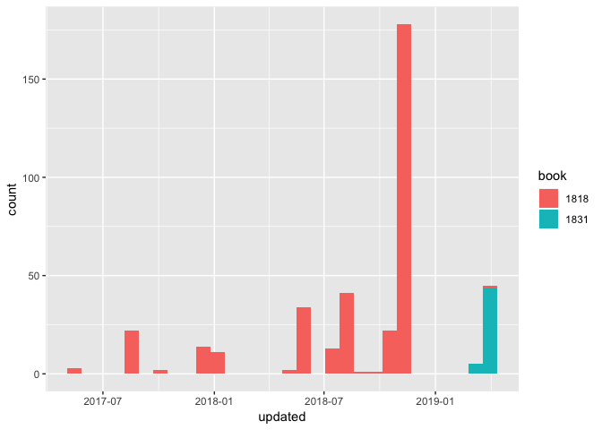
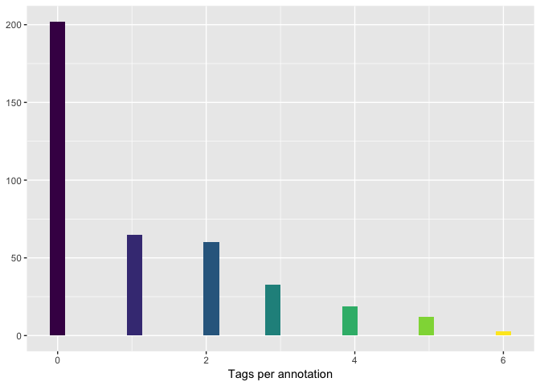
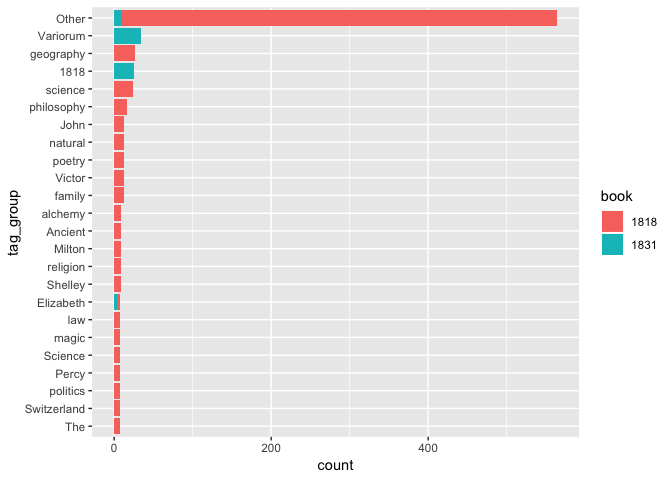
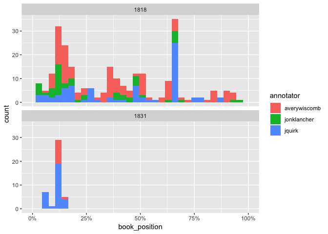

This report is based on the status of Frankenstein hypothes.is
annotations as of 2019-04-12

Timeline
--------

84.0% of annotations are directly on the text, while another 16.0% are
comments on other annotations.

Tags
----

Of the 60.7% of annotations that have tags:

Book location
-------------

I’ve approximated the annotation locations based on the paragraph
numbers they’re anchored to.

