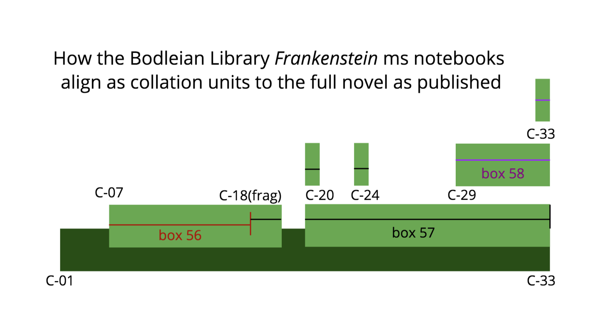

## Preliminary Edition Data

This directory contains edition files prepared in XML for each of the five editions
 in the Frankenstein Variorum for machine-assisted collation. The files are freely available, but
we would appreciate your citing the Frankenstein Variorum project as their source. Please note that
the files in this directory contain no collation data, because they repreesent a first stage of 
text preparation necessary for the collation process.  

The markup in these editions is prepared to be part of the collation process, in order to:
* include its 
information about structure (paragraph and chapter boundaries, for example) together
with the content, 
* include markup of deletions and insertions from the manuscript material from the Shelley-Godwin Archive as 
well as in the Thomas Copy. 
* include boundary indicators for 33 collation units. Each edition was divided into units roughly the size of a chapter. 
This was designed to facilitate collation of the novel in aligned ”chunks” to help prevent errors. Each edition shares
`<anchor>` elements that mark the beginning of each collation unit, labeled with `@xml:id` attribute values of "C01" to "C33"

### 1818 and 1831 texts 
The files for the 1818 and 1831 texts were derived from the codebase for the Pennsylvania Electronic Edition.
They were transformed using Perl regular expresssions from their original HTML to a simple structure of XML that enabled us to follow the structure of volumes,
chapters, paragraphs, and lines of poetry, all of which were important to trace in the collation process. This
code was corrected on consulting photo facsimiles of each print edition.

### The Thomas Copy
The Thomas Copy was prepared from the XML of the 1818 text, and Elisa Beshero-Bondar added encoded data about handwritten
insertions, deletions, and marginal annotations on consulting the text held at the Pierpont Morgan Library, and making editorial decisions
based on Nora Crook's and James Rieger’s editions of *Frankenstein* that represent content from the Thomas Copy.  

### 1823 text
The 1823 text was prepared from OCR of a photo facsimile by librarians at Carnegie Mellon University, 
and corrected by consulting the text. It was encoded in XML consisent with the markup of 
the 1818, 1831, and Thomas copy texts.

### Manuscript Notebook texts
The files for the Shelley-Godwin Archive (S-GA) were combined together from their page-by-page structure
and to reposition marginal insertions, which had been encoded at the end of each file. We 
resequenced these following the xml:ids and pointers in the documents in order to position these
insertions and notes at their points of insertion as interpreted by the editors of the S-GA.
This permitted us to collate them in semantic reading sequence. The S-GA archive code represents the contents of three boxes at
the Bodleian library, numbered 56, 57, and 58. Of these, Boxes 56 and 57 contain one more-or-less continuous version of the novel, together
with two fragmentary extra portions. 
* Box 56 is missing the very beginning of the novel (the letters from Walton) and begins a few
collation units into the novel at the point we mark C07 (the first moment when all five editions are present). 
* Box 56 includes collation units C07 through a part of C18.
* Box 57 begins with C20, and thus there is a gap of a portion of C18 and C19 in the Shelley-Godwin Archive. 

While there is a significant gap, the S-GA also holds extra versions of specific passages, which we have stored here
in the directory "msColl-fragments." We have not as yet attempted to include these in the collation process, but they are available here
as part of the data we organized for the project. 
* Box 57 contains extra fragmentary material of collation units C20 and C24
* Box 58 contains an extra fragment covering collation units C18 through C33, and one additional fragmentary version from C33. 

The gap and the extra fragments available from the Shelley-Godwin Archive are summarized in this visual:

### "Flattened" Markup for Collation 
The directory named "flattened-markup-collation" contains files prepared in the very last stage of pre-processing for collation. 
These files are the result of an XSLT script over the normally marked files, and every XML element that contained text was converted to
two self-closing elements so that markup and text were on the same level of the XML hierarchy. 

Our method of constructing the digital edition files from collation data required us to flatten the markup prior to collation. 
This was necessary to reconstruct the XML edition files following the collation process. 
* The collation (via collateX) often captured variant passages in the middle of one paragraph and spanned to the middle of the next paragraph. 
* That meant that a passage marked as a variation would contain a structural end-tag followed by a start-tag. 
* In our post-processing
following the collation, we would reconstruct the original structure of the edition files working around overlapping hierarchies imposed by adding
`<seg>` elements around variant passages, and it was very helpful to have flattened elements in place at the start of this process.

